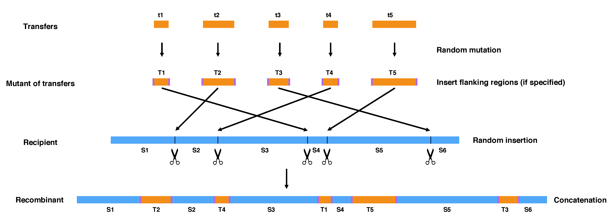
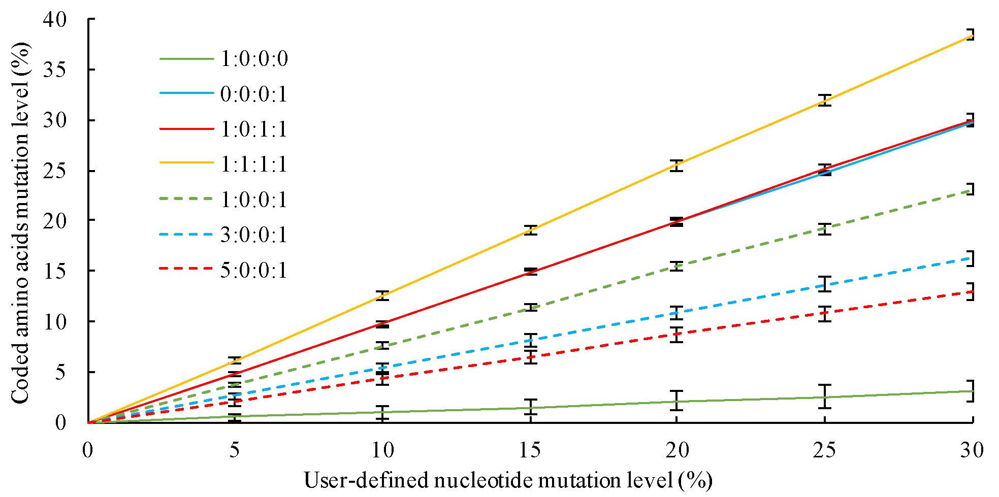

Publication
---
+ Song W, Steensen K, Thomas T. (2017) HgtSIM: a simulator for horizontal gene transfer (HGT) in microbial communities. PeerJ 5:e4015 https://doi.org/10.7717/peerj.4015
+ Contact: Weizhi Song (songwz03@gmail.com), Torsten Thomas(t.thomas@unsw.edu.au)
+ Affiliation: The Centre for Marine Bio-Innovation (CMB), The University of New South Wales, Sydney, Australia

Dependencies
---

+ [BioPython](https://github.com/biopython/biopython.github.io/)
+ [BLAST+](https://blast.ncbi.nlm.nih.gov/Blast.cgi?PAGE_TYPE=BlastDocs&DOC_TYPE=Download)

Change Log
---
+ 2018-04-06:
    1. combined the '-mixed', '-mini' and '-maxi' options to '-mixed min-max'.
+ 2017-09-16:
    1. added support for draft genome.
    1. added support for dynamic flanking sequences.
    1. added support for the 'mixed' mode.
    1. added support for the 'keep_cds' option.

Workflow
---

Help information
---

        # HgtSIM is implemented in python3, please use python3 instead of python.

        python3 HgtSIM.py -h

        arguments:
          -t          sequences of genes to be transferred (multi-fasta format)
          -i          mutation level
          -d          distribution of transfers to the recipient genomes
          -f          folder holds recipient genomes
          -r          ratio of mutation types
          -x          file extension of recipient genomes
          -lf         left end flanking sequences
          -rf         right end flanking sequences
          -mixed      randomly assign mutation levels between specified values, parameter format: min-max
          -keep_cds   insert transfers only to non-coding regions, need the annotation
                      files (in gbk format) of recipient genomes
          -a          folder holds the annotation files (in gbk format) of recipient
                      genomes
          -l          the minimum length of intergenic regions to be considered for
                      insertion

Input files and arguments
---

1. Sequences of genes to be transferred (in multi-fasta format).
1. A folder holds all recipient genomes, one file per genome.
1. The mutation level of genes to be transferred. This can be specified either as a fixed value, or within a range (the 'mixed' mode). If the 'mixed' argument was provided,
HgtSIM will randomly select a value between user specified minimum and maximum mutation levels to alter each gene transfer.

        # with fixed mutation level (e.g. 10%).
        python3 HgtSIM.py -t genes.fasta -d distribution.txt -f input_genomes -r 1-0-1-1 -x fna -i 10

        # with 'mixed' mode (e.g. 5-25%)
        python3 HgtSIM.py -t genes.fasta -d distribution.txt -f input_genomes -r 1-0-1-1 -x fna -mixed 5-25

1. The ratio of mutation categories (separated with dash). The default setting is '1-0-1-1'. Please refer to the publication (http://dx.doi.org/10.7717/peerj.4015) or the figure below for its setting.

    

1. The distribution of transfers to the recipient genomes. The first column refers to the recipient genomes(without file extension), followed by a list of genes to be transferred therein (separated with comma).

        BAD,AAM_03063,AKV_01007,AMAC_01196,AMAU_02632,AMS_01785
        BDS,AAM_00175,AKV_00943,AMAC_00215,AMAU_02085,AMS_01465
        BGC,AAM_00176,AKV_01272,AMAC_01576,AMAU_00617,AMS_02653
        BHS,AAM_00195,AKV_01273,AMAC_01674,AMAU_05963,AMS_03303
        BNM,AAM_00209,AKV_00282,AMAC_02914,AMAU_02414,AMS_03378
        BRT,AAM_00308,AKV_02353,AMAC_03303,AMAU_00830,AMS_01655

1. The flanking sequences to be added to the end of gene transfers. Can be specified with '-lf' and '-rf', the default value is None.

        # introduce gene transfers without adding flanking sequences
        python3 HgtSIM.py -t genes.fasta -i 10 -d distribution.txt -f input_genomes -r 1-0-1-1 -x fna

        # or, add same pair of flanking sequences (e.g. 'TAGATGAGTGATTAGTTAGTTA') to all gene transfers
        python3 HgtSIM.py -t genes.fasta -i 10 -d distribution.txt -f input_genomes -r 1-0-1-1 -x fna -lf TAGATGAGTGATTAGTTAGTTA -rf TAGATGAGTGATTAGTTAGTTA

        # or, add flanking sequences dynamically to the two ends of each gene transfer
        python3 HgtSIM.py -t genes.fasta -i 10 -d distribution.txt -f input_genomes -r 1-0-1-1 -x fna -lf lf.fasta -rf rf.fasta

    if you want to add flanking sequences dynamically to the gene transfers, you can specify the left and right side sequences in two multi-fasta files.
    The IDs of the flanking sequences need to be exactly the same to their corresponding gene transfers.

    As an illustration, if you have four transfers, which are transfer_A, transfer_B, transfer_C and transfer_D. And you have provided the following two files:

    lf.fasta

        >transfer_A
        AAAAAAAAAA
        >transfer_B
        TTT

    rf.fasta

        >transfer_A
        GGGGGGG
        >transfer_C
        CCCCC

    HgtSIM will then:
    1. add 'AAAAAAAAAA' to the left and 'GGGGGGG' to the right end of transfer_A;
    2. add 'TTT' to the left and nothing to the right end of transfer_B;
    3. add nothing to the left and 'CCCCC' to the right end of transfer_C;
    4. add nothing to boths end of transfer_D.

1. Transfers can be inserted only to the intergenic regions by specifying the 'keep_cds' option. The annotation files (in
genbank format) of the recipient genomes are needed to enable this option.

Output files
---

1. Produced genomes with transferred genes, which were placed in folder 'Genomes_with_transfers'.
1. The amino acid sequences of input genes to be transferred.
1. The nucleotide and amino acid sequences of mutated input genes.
1. The mutation report file, which includes two parts:
    1. on the top is the nc and aa identities between input and mutated sequences for each transfer.
    1. followed by a summary of changed nucleotide bases for each transfer.
1. The insertion report file.
